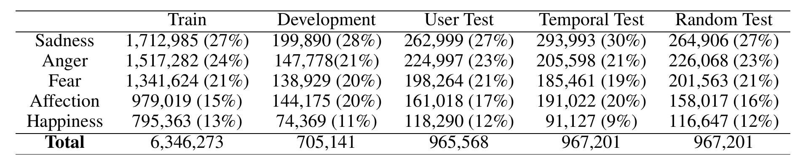

```{r xaringan-themer, include=FALSE, warning=FALSE}
#This block contains the theme configuration for the CSS lab slides style
library(xaringanthemer)
library(showtext)
style_mono_accent(
  base_color = "#5c5c5c",
  text_font_size = "1.5rem",
  header_font_google = google_font("Arial"),
  text_font_google   = google_font("Arial", "300", "300i"),
  code_font_google   = google_font("Fira Mono")
)
```

```{r setup, include=FALSE}
options(htmltools.dir.version = FALSE)
```


layout: true
<div class="my-footer"><span>David Garcia - Augmented Intelligence Workshop</span></div> 

---

background-image: url(figures/AboutUS.svg)
background-size: 98%

---

# Our Research Topics


---

# Outline

</br>

## 1. Collective Emotions

## 2. Detecting Individual Emotions in Social Media

## 3. Social Media Macroscopes of Emotions


---

# The Question of Collective Emotions

<center>
```{r, echo=FALSE, out.width=720}
knitr::include_graphics("figures/ColectiveEmotions.png")
```
</center>
- **Collective emotions (von Scheve and Salmela, 2014):**   
Emotional states shared by a large amount of people at the same time
- **Collective emotions are complex behaviors:** Compared to individual emotions, they can last longer, be stronger, and change in quality  

[Collective Emotions. Amit Goldenberg, David Garcia, Eran Halperin, James Gross. Current Directions in Psychological Science (2020)](https://journals.sagepub.com/doi/10.1177/0963721420901574)

---

## The challenge of studying collective emotions

- Collective emotions are more challenging to study than individual emotions:
  - **Experimentation is not as simple:** need for group experiments rather than individual experiments
  - **Measurement is complicated:** need to measure many people together
    - Self-reports can disrupt the social interaction process
  - **Manipulation can be dangerous:** not just individual informed consent


- Social media offer a window to **observe** collective emotions
  - Large groups of people interacting *in vivo*
  - Natural exposure to the emotional expression of others
  - Long observation periods, additional metadata such as social links
  - However, methods are still young, samples are self-selected, experimentation is still very hard

---

layout: true
<div class="my-footer"><span>LEIA: Language Embeddings for the Identification of Affect. Working Paper. Model: https://huggingface.co/saroyehun/LEIA-large</span></div> 

---


## Detecting Individual Emotions in Social Media

</br>

## 1. Collective Emotions

## *2. Detecting Individual Emotions in Social Media*

## 3. Social Media Macroscopes of Emotions


---

## Challenges in individual emotion detection

**The problem with sentiment analysis: Writer versus reader emotions**

```{r, echo=FALSE, out.width=950, fig.align='center'}
knitr::include_graphics("figures/communication.png")
```

Current sentiment analysis approaches assume that the **ground truth** is an annotation of emotions by **a reader**, often a student or a crowdsourcing worker

---

### LEIA: Linguistic Embeddings for the Identification of Affect


---

# Datasets summary

- Vent dataset samples:


- Out-of-domain validation datasets:
<center>  </center>

---

# Results in Vent


- $F_1$ metric measures the quality of the prediction, from 0 (terrible) to 1 (perfect)
- LEIA outperforms supervised and unsupervised methods
- This performance is consistent across emotions
- Results generalize across users and time
---

# Out-of-domain results


- LEIA is best or tied with the best in all out-of-domain tests
- LEIA is best or tied with the best in all emotions except Fear in TEC
- Performance is very high for two reference standards: enISEAR and SemEval

Try it yourself:
https://huggingface.co/saroyehun/LEIA-large

Peprint to be posted soon - LEIA: Linguistic Embeddings for the Identification of Affect. S. Aroyehun, L. Malik, H. Metzler, N. Haimerl, A. Di Natale, D. Garcia

---

# Social Media Macroscopes of Emotions

</br>

## 1. Collective Emotions

## 2. Detecting Individual Emotions in Social Media

## *3. Social Media Macroscopes of Emotions*

---

# Social Media Macroscopes

```{r, echo=FALSE, out.width=800, fig.align='center'}
knitr::include_graphics("figures/earth.svg")
```

---

layout: true
<div class="my-footer"><span>
<a href=https://arxiv.org/abs/2107.13236> Social media emotion macroscopes reflect emotional experiences in society at large. David Garcia, Max Pellert, Jana Lasser, Hannah Metzler. https://arxiv.org/abs/2107.13236 (2021)</a></span></div>


---

# Social Media Macroscopes of Emotions

.pull-left[
```{r, echo=FALSE, out.width=500}
knitr::include_graphics("figures/Paris.png")
``` 
]

.pull-right[
Concerns about macroscopes:
1. Representation issues

2. Performative behavior

3. Measurement error and bias

4. Researcher degrees of freedom
]

*Collective Emotions and Social Resilience in the Digital Traces After a Terrorist Attack. Garcia & Rimé, Psychological Science (2019)*

---


# Validating a UK emotion macroscope

```{r, echo=FALSE, out.width=975, fig.align='center'}
knitr::include_graphics("figures/MacroTest2.svg")
```

---

# Sadness in Twitter and YouGov

```{r, echo=FALSE, out.width=1200, fig.align='center'}
knitr::include_graphics("figures/Sadness.svg")
```

- Similar results with dictionary-based and supervised methods (r~0.65)
---
# Anxiety in Twitter and YouGov

```{r, echo=FALSE, out.width=1200, fig.align='center'}
knitr::include_graphics("figures/Anxiety.svg")
```

- Improvement thanks to gender information in tweets

---
# Joy in Twitter and YouGov

```{r, echo=FALSE, out.width=1200, fig.align='center'}
knitr::include_graphics("figures/Joy.svg")
```

- Good correlation with supervised method but no correlation with dictionary-based method

---

layout: true
<div class="my-footer"><span>
<a href=https://www.nature.com/articles/s41598-022-14579-y>
Validating daily social media macroscopes of emotions. Max Pellert, Hannah Metzler, Michael Matzenberger, David Garcia. Scientific Reports (2022)</a></span></div>

---

## Reproducing with an Austrian daily macroscope

.pull-left[

- 20-day emotion survey in derstandard.at (N=268,128)
- Daily frequency, 3-day windows

- Text from Der Standard forum (N=452,013)

- Austrian tweets (N=515,187) filtered as UK macroscope

- Compared dictionary-based (LIWC) and supervised model (GS)

]
.pull-right[
```{r, echo=FALSE, out.width=900}
knitr::include_graphics("figures/DS1.svg")
```
]

---


## Online Media for Social Sensing of Emotions

```{r, echo=FALSE, out.width=850, fig.align='center'}
knitr::include_graphics("figures/socialsensing.svg")
```

---

## Social media macroscopes: Take-home message


<a href=https://www.nature.com/articles/s41598-022-14579-y>
Validating daily social media macroscopes of emotions. Max Pellert, Hannah Metzler, Michael Matzenberger, David Garcia. Scientific Reports (2022)

<a href=https://arxiv.org/abs/2107.13236> Social media emotion macroscopes reflect emotional experiences in society at large. David Garcia, Max Pellert, Jana Lasser, Hannah Metzler. https://arxiv.org/abs/2107.13236 (2021)

<a href=https://worldhappiness.report/ed/2022/using-social-media-data-to-capture-emotions-before-and-during-covid-19/> Using social media data to capture emotions before and during COVID-19. Hannah Metzler, Max Pellert, David Garcia. World Happiness Report (2022)
---


# Summary

- **Aim: Understanding Collective Emotions**
  - Challenging case due to complexity and social components
  - Social media could work if we have the right methods
  

- **Detecting Individual Emotions from Social Media Text**
  - LEIA as an AI approach to estimate self-labelled emotions
  - Good performance in out-of-domain tests


- **Social Media Macroscopes of Emotions**
  - Macroscopes of emotions in the UK agree with survey data
  - Replication in Austria in Der Standard

.center[**More at: [www.dgarcia.eu](https://dgarcia.eu) and [@dgarcia_eu](https://twitter.com/dgarcia_eu)**  

**Thanks for listening!**
]

